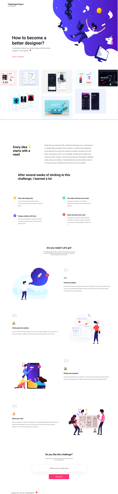

# Project The Design

## Überblick

**Project The Design** ist eine Landingpage, die speziell für Design-Challenges erstellt wurde.
Dieses Projekt konzentriert sich auf die Vertiefung von **HTML** und **CSS**-Kenntnissen.

[Hier kannst du die Live-Demo ansehen](https://manonsfoto.github.io/Tag13_Project_The_Design/)

## Technologien

- **HTML5**: Strukturierung der Webseite und Inhaltsdarstellung.
- **CSS3**: Visuelles Styling der Seite, inklusive Layout, Farben und Animationen.

## Projektvorschau

